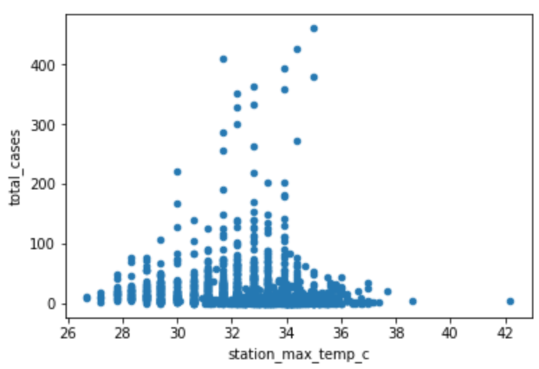
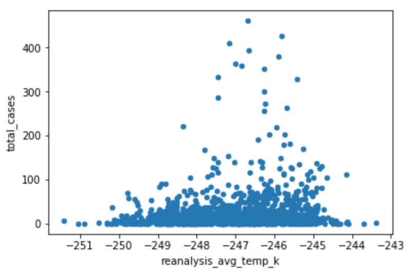
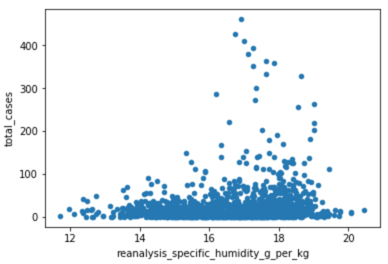

<html>

<head>
<title>Title</title>
</head>

<body>

<h1> Dengue Fever Overview </h1>

<h2> Understanding Dengue Fever </h2>
<p>Dengue fever is a mosquito-borne, viral disease that is prominent in tropical and subtropical regions of the world. The disease causes flu-like symptoms such as rash, high fever, and muscle/joint pain and in serious cases, death. The disease is transmitted mainly through mosquito bites by the urban yellow fever mosquito (Aedes aegypti) which are principle carriers of the infection. The number of cases of Dengue fever has rapidly increased in the past three decades due to changes in environmental variables such as temperature, precipitation and climate, leaving more than half the world’s population at risk of contracting the disease. It has been found that these mosquitoes reproduce and bite humans more frequently at higher temperatures. While dengue fever has become an epidemic as of late, there is still no specific, curative treatment that has been found.</p>

<p>Not only does Dengue fever have serious health implications on those affected, but there are also social and economic burdens that arise globally. The mosquitoes who carry this infection breed in “artificial water containers” and such habitats have been found in urban areas at an increasing rate. To combat this, communities have tried using insecticide sprays and organized clean up campaigns to help alleviate the mosquito habitats however found no lasting results. Significant economic effort is required from communities to create methods in controlling the outbreak of Dengue such as investing in biological research, chemical tools, and awareness events to inform people of Dengue fever and how to prevent it. This has serious implications for low-income, developing countries who are at most risk of contracting the fever. Along with the health and economic burdens that Dengue fever brings, there are also many social implications. This disease affects both adult and children alike, which severly impacts family life. Many families are forced to quit their jobs either from being sick themselves, or to take care of loved ones who have been impacted by the disease. Efforts for forecasting Dengue fever is important to allow health agencies better organize information about treatments and fight life-threatening pandemics. </p>


<p>The dataset was provided by DataDriven.org which includes environmental data from San Juan, Puerto Rico and Iquitos, Peru. The data was collected from various U.S. Federal Government agencies—from the Centers for Disease Control, Prevention to the National Oceanic and Atmospheric Administration in the U.S. Department of Commerce. The dataset contains variables such as Maximum temperature, Minimum temperature, Average temperature, Total precipitation Diurnal temperature range, Air temperature, Precipiation and Vegetation. These are all important variables to track as they are pertinent to the environment and are transmitted by mosquitoes. In this report, we will explore these variables further and assess how these factors play a role in the number of Dengue fever cases in these two cities.  </p>


<h3> References </h3>

<p> <a href="https://www.ncbi.nlm.nih.gov/pmc/articles/PMC4784057/">Reference 1</a> </p>
<p><a href="https://www.ncbi.nlm.nih.gov/pmc/articles/PMC5428083/">Reference 2</a></p>
<p><a href="https://journals.plos.org/plosntds/article?id=10.1371/journal.pntd.0005366 
">Reference 3</a></p>

<p><a href="https://opencommons.uconn.edu/dissertations/AAI9326202/">Reference 4</a></p>

<p><a href="http://www.who.int/heli/risks/vectors/denguecontrol/en/">Reference 5</a></p>

<p><a href="http://www.who.int/news-room/fact-sheets/detail/dengue-and-severe-dengue">Reference 6</a></p>

---
output: html_document
---

```{r setup, include=FALSE}
knitr::opts_chunk$set(echo = TRUE)
library(ggplot2)
library(shiny)
library(dplyr)
library(tidyr)
library(reshape2)
```

## Visualizations

```{r echo = FALSE, message = FALSE, warning=FALSE}
data <- read.csv("output/OG_data_cases.csv")
sun_iq <- read.csv("data/Sunshine_Iquitos.csv")
sun_sj <- read.csv("data/Sunshine_San_Juan.csv")
sj_data <- read.csv("output/sj_data.csv")
iq_data <- read.csv("output/iq_data.csv")

```

### Sunshine Hours - Exploratory Variable
These visualizations represent the hours of sunshine the cities of Iquitos and San Juan receive on average during the year. From our research, we found that mosquitos who carry the dengue infection reproduce and bite humans at a higher rate during times of high temperatures. We wanted to explore if the amount of sunshine duration during a particular time of the year had a correlation with the amount of cases there were in a specific month. We hypothesized that in Iquitos, the months of July, August and September would have the most number of cases since these months had a higher amount of sunshine hours on average. For San Juan, we predicted the months of March, April, June, July, August, and September would have the most number of cases which in turn would lead to this city having more cases of dengue fever than Iquitos. 


```{r echo = FALSE, message = FALSE, warning=FALSE}
sun_iq <- as_data_frame(sun_iq)
sun_sj <- as_data_frame(sun_sj)

ggplot(data=sun_iq, aes(x=Month , y=Sunshine, fill=Month)) +  
    labs(title = "Sunshine Hours in Iquitos", subtitle = "Data provided by Holiday Weather")+
    scale_x_discrete(limits = month.abb) +
    geom_bar(colour="black", stat="identity") +
    guides(fill=FALSE)

ggplot(data=sun_sj, aes(x=Month, y=Sunshine, fill=Month)) +
    labs(title = "Sunshine Hours in San Juan", subtitle = "Data provided by Holiday Weather")+
    scale_x_discrete(limits = month.abb) +
    geom_bar(colour="black", stat="identity") +
    guides(fill=FALSE)
```


### Precipitation Amount
These next set of visualizations represent the total number of dengue cases based on precipitation amounts (in mm). The climate has a significant impact on the emergence of dengue in a region. Increase in rainfall specifically has been an indicator of rising dengue cases, so we used precipitation_amt_mm to assess the relationship between differing levels in rainfall and the amount of dengue cases that arise in San Juan and Iquitos. 

Looking at the plot for San Juan, we observed a few outliers but for the most part observed an upwards trend in the number of cases as precipitation amounts increased. The same conclusion did not hold true for Iquitos however, since the number of cases decreased a bit as the rainfall amount increased. From these plots, we cannot conclude that precipitation is a strong factor in predicting dengue cases, but it is still important to consider in our predictive analysis.   


```{r echo = FALSE, message = FALSE, warning=FALSE}

sj_data$pc <- predict(prcomp(~reanalysis_avg_temp_k+precipitation_amt_mm, sj_data))[,1]

ggplot(sj_data, aes(precipitation_amt_mm, total_cases, color = pc)) +
  labs(title = "Preciptation vs Total Cases in San Juan")+
  geom_point(shape = 16, size = 5, show.legend = FALSE, alpha = .4) +
  theme_minimal() +
  scale_color_gradient(low = "#0091ff", high = "#f0650e")

iq_data$pc <- predict(prcomp(~reanalysis_avg_temp_k+precipitation_amt_mm, iq_data))[,1]

ggplot(iq_data, aes(precipitation_amt_mm, total_cases, color = pc)) +
  labs(title = "Preciptation vs Total Cases in Iquitos")+
  geom_point(shape = 16, size = 5, show.legend = FALSE) +
  theme_minimal() +
  scale_color_gradient(low = "#0091ff", high = "#f0650e")
```


### Dengue Over the Years
The last set of visualizations showcase the number of cases of dengue over the years in each city. While dengue has re-emerged in the past three decades, cases in Iquitos and San Juan have been decreasing on average.


```{r echo = FALSE, message = FALSE, warning=FALSE}

ggplot(data=sj_data, aes(x=year, y=total_cases, fill=year)) +
  geom_bar(stat="identity", show.legend = FALSE) 

scaleFUN <- function(x) sprintf("%.0f", x)
ggplot(data=iq_data, aes(x = year, y=total_cases, fill=year)) +
  scale_x_continuous(labels=scaleFUN) +
  geom_bar(stat="identity", show.legend = FALSE)

```

<p> <h3> Statistical Modeling </h3> </p>

Before modeling our dataset, we wanted to understand how each variable interacted with one another; most importantly, we wanted to understand the correlation between each variable and the total number of cases of Dengue in each city, San Juan and Iquitos. We analyzed the data througha powerful data visualization tool called powerBI. On powerBI, we compared each variable and its correlation to the total number of dengue cases per city. We have included a multiple series bar plot below to visualize the variables per city. The visual includes the total number of Dengue cases, the average temperature in Kelvin, humidity (g per kg), station average temperature, station max temperature, and precipitation amount. Based on this visualization alone, we can see the differences and similarities; we can automatically determine that the similarities may not be the direct cause of Dengue, as San Juan has higher levels of Dengue than Iquitos. It is also important to note that many other variables were included in the available dataset, such as vegetation, but based on our research and visualizations, they showed little correlation to Dengue cases. We thus focused our modeling on four variabes: station_max_temp, reanalysis_avg_temp_k, station_avg_temp, and reanalysis_specific_humidity_g_per_kg.   


## Forward Selection

Forward selection is the process of adding variables to a linear regression model with the objective of strengthening correlation between two factors. 

We chose to do the statistical modeling on python, and use the .summary() function to understand different R values and P values. 

The first linear model compared total_cases to station_avg_temperature. The summary shows a low R-Squared value of .013, and negligible P-value.

The second linear model compared total_cases to station_avg_temperature and reanalysis_avg_temp_k. The R-squared value doubles to .022, and the p-value for station_avg_temp_c jumps to .834. This shows a strong correlation between the two.

The third linear model compared total_cases to station_avg_temperature, reanalysis_avg_temp_k, and station_max_temp_c. The R-squared value spikes again to .057, though all the p-values drop. 

The fourth linear model compared total_cases to station_avg_temperature, reanalysis_avg_temp_k, station_max_temp_c, and reanalysis_specific_humidity_g_per_kg. The R-squared value increases slightly to .058. The p-values stay small, however. 

## Correlation

Correlation between max temperature and total cases:

{width=500px}


Correlation between average temperature and total cases:

{width=500px}


Correlation between station average temperature and total cases:
{width=500px}


Correlation between humidity and total cases:

{width=500px}


## Predictions

We created a prediction model using our fourth linear regression model - this includes the four aforementioned variables. We plotted our predictions, which show a low number of total cases predicted. Our prediction model is shown below.

{width=500px}

{width=500px}

## Residuals
In regression analysis, the difference between the observed value of the dependent variable and the predicted value is called the residual. We created a residual plot to show whether our model was a good fit for the data, and because of its linearity, it shows that our model does fit.  

{width=500px}

## Interpretation

Our team used PowerBI, a data analytics tool from Microsoft, to visually compare the differences in environmental variables between the two cities, to assess which variables to focus on in our model. Based on our observations and research, we decided to hone in on 4 variables in our modeling set: station_max_temp_c, reanalysis_avg_temp_k, station_avg_temp, and reanalysis_specific_humidity_g_per_k. These 4 variables had the biggest variability between San Juan and Iquitos which sparked our curiosity into exploring the relationships between those factors and the total number of dengue fever cases. 

We believed that using a linear regression model would be the most appropriate for our dataset because the nature of the data is mainly quantitative. Linear regression models help evaluate whether or not there is a relationship between the independent variable (one of the four environmental variables) and dependent variable (total number of dengue fever cases). We used forward selection to see if the combination of these variables had a stronger correlation with the number of cases in Iquitos and San Juan. From doing a forward selection systematic comparison, we observed an increase in the R-squared value, with a final value of 0.058. While this isn’t the highest R squared value, we found that the p-value was the highest during our second linear regression step which includes station_avg_temp_c and reanalysis_avg_temp_k for station_avg_temp_c for a value of 0.834. This shows that the strength of correlation decreases as variables like maximum temperature and humidity were added into the model. Unfortunately, our model does not accurately predict the number of cases, however we would try other approaches such as negative binomial distribution or a logistic regression model to attain a higher R-squared value and higher prediction accuracy.

<h1>
<p>
Who Are We?
</p>
</h1>

<p>
Hi! Our names are Nicole Bohra and Ansul Sinha. We are <b>INFO 370</b> students who use technology and programming languages to analyze data. We use our skills in these areas to create interactive data visualizations that help people better understand information. Afterall, information is data in human context. By wrangling data in R, we're able to design a better means of communicating information in ways that make sense to people. We hope to use data to tell stories, explain phenomenom, and make a difference. This project aims to study the variables that may cause Dengue Fever, a prominent, sometimes fatal, disease. We hope you find this information helpful. 
</p>

<h1>
<p>
Purpose:
</p>
</h1>
<p>
Our application builds an experience between viewers and the visualizations on Dengue Fever. Pertinent information includes where the variables that may play a role in cases of Dengue within a certain time-frame. 
</p>
<p>
A user has the choice to choose different options that then reflect within the visualizations in order for them to draw their own conclusions. We also included our own interpretations with more solidified visualizations contrasting specific variables.
</p>

<h1>
<p>
Dataset:
</p>
</h1>
<p>
The raw dataset can be found <a href="https://github.com/info370a-au18/a3-ansul27/tree/gh-pages/data"> here. </a>
</p>

<p>
It is titled <i> “Dengue Fever Training Set,” </i> containing information relevant to environmental factors. However, we simplified this data to better interpret it. Our changes include merging this data set with the features to understand the number of total cases and how that varies with different variables. We also deal with empty values using drop_na(), and exclude them from our analysis. The new variable we created was the number of sunshine hours. Based on our research, we found external variables (such as weather) play more of a role than vegetation, and wanted to further explore the relationship between sunshine and dengue. 
</p>


</body>
</html>


