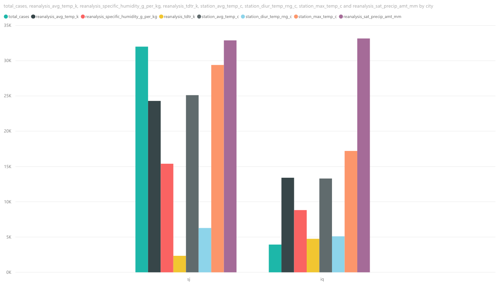
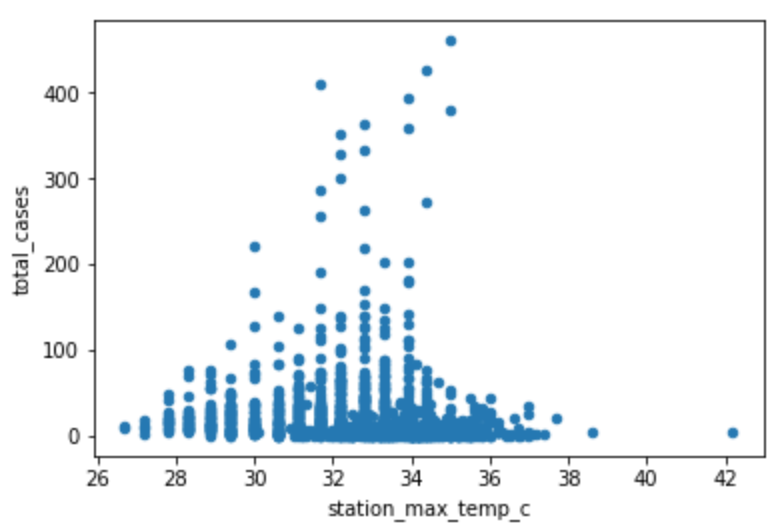
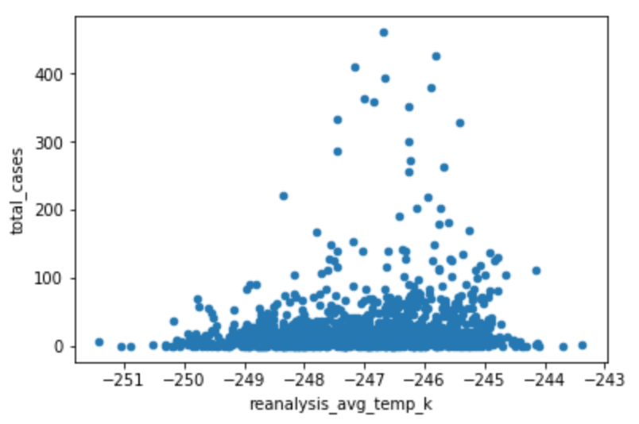
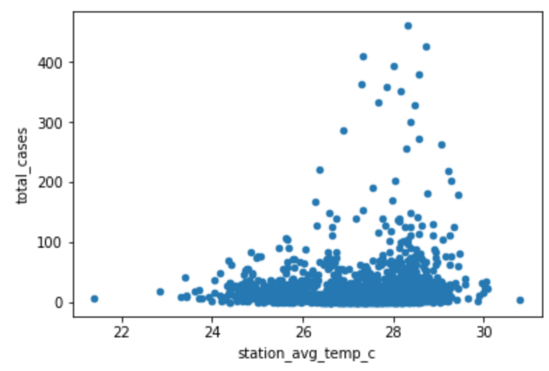
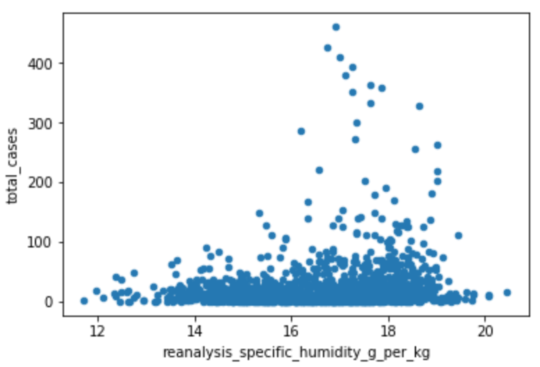
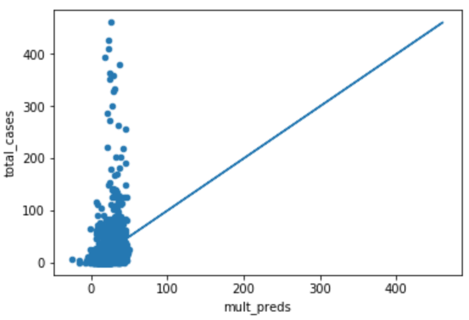
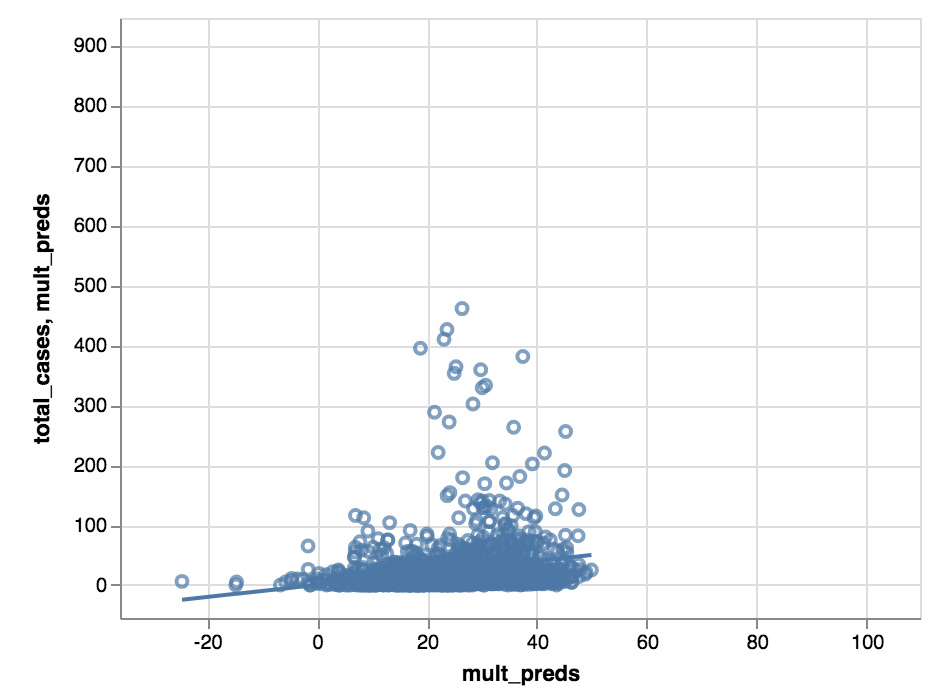
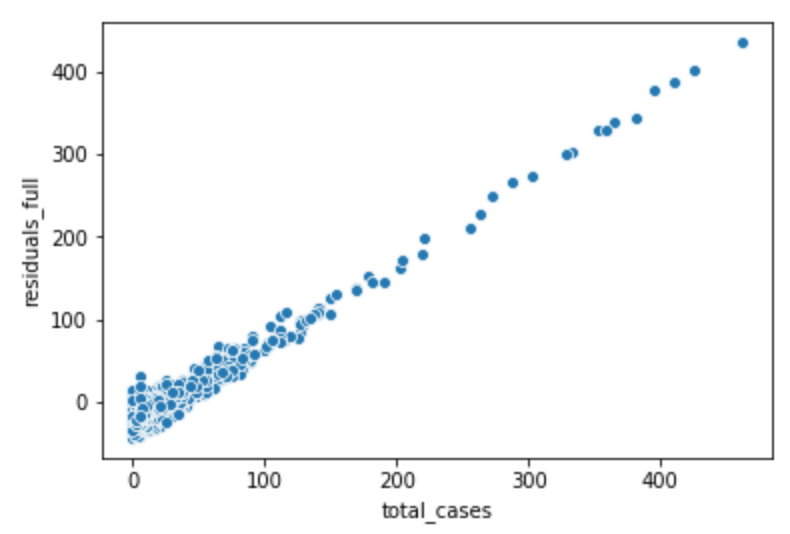

Before modeling our dataset, we wanted to understand how each variable interacted with one another; most importantly, we wanted to understand the correlation between each variable and the total number of cases of Dengue in each city, San Juan and Iquitos. We analyzed the data througha powerful data visualization tool called powerBI. On powerBI, we compared each variable and its correlation to the total number of dengue cases per city. We have included a multiple series bar plot below to visualize the variables per city. The visual includes the total number of Dengue cases, the average temperature in Kelvin, humidity (g per kg), station average temperature, station max temperature, and precipitation amount. Based on this visualization alone, we can see the differences and similarities; we can automatically determine that the similarities may not be the direct cause of Dengue, as San Juan has higher levels of Dengue than Iquitos. It is also important to note that many other variables were included in the available dataset, such as vegetation, but based on our research and visualizations, they showed little correlation to Dengue cases. We thus focused our modeling on four variabes: station_max_temp, reanalysis_avg_temp_k, station_avg_temp, and reanalysis_specific_humidity_g_per_kg.   

## Forward Selection

Forward selection is the process of adding variables to a linear regression model with the objective of strengthening correlation between two factors. 

We chose to do the statistical modeling on python, and use the .summary() function to understand different R values and P values. 

The first linear model compared total_cases to station_avg_temperature. The summary shows a low R-Squared value of .013, and negligible P-value.

The second linear model compared total_cases to station_avg_temperature and reanalysis_avg_temp_k. The R-squared value doubles to .022, and the p-value for station_avg_temp_c jumps to .834. This shows a strong correlation between the two.

The third linear model compared total_cases to station_avg_temperature, reanalysis_avg_temp_k, and station_max_temp_c. The R-squared value spikes again to .057, though all the p-values drop. 

The fourth linear model compared total_cases to station_avg_temperature, reanalysis_avg_temp_k, station_max_temp_c, and reanalysis_specific_humidity_g_per_kg. The R-squared value increases slightly to .058. The p-values stay small, however. 

## Correlation

Correlation between max temperature and total cases:

{width=500px}

Correlation between average temperature and total cases:

{width=500px}

Correlation between station average temperature and total cases:
{width=500px}

Correlation between humidity and total cases:

{width=500px}

## Predictions

We created a prediction model using our fourth linear regression model - this includes the four aforementioned variables. We plotted our predictions, which show a low number of total cases predicted. Our prediction model is shown below.

{width=500px}

{width=500px}

## Residuals
In regression analysis, the difference between the observed value of the dependent variable and the predicted value is called the residual. We created a residual plot to show whether our model was a good fit for the data, and because of its linearity, it shows that our model does fit.  

{width=500px}

## Interpretation

Our team used PowerBI, a data analytics tool from Microsoft, to visually compare the differences in environmental variables between the two cities, to assess which variables to focus on in our model. Based on our observations and research, we decided to hone in on 4 variables in our modeling set: station_max_temp_c, reanalysis_avg_temp_k, station_avg_temp, and reanalysis_specific_humidity_g_per_k. These 4 variables had the biggest variability between San Juan and Iquitos which sparked our curiosity into exploring the relationships between those factors and the total number of dengue fever cases. 

We believed that using a linear regression model would be the most appropriate for our dataset because the nature of the data is mainly quantitative. Linear regression models help evaluate whether or not there is a relationship between the independent variable (one of the four environmental variables) and dependent variable (total number of dengue fever cases). We used forward selection to see if the combination of these variables had a stronger correlation with the number of cases in Iquitos and San Juan. From doing a forward selection systematic comparison, we observed an increase in the R-squared value, with a final value of 0.058. While this isn’t the highest R squared value, we found that the p-value was the highest during our second linear regression step which includes station_avg_temp_c and reanalysis_avg_temp_k for station_avg_temp_c for a value of 0.834. This shows that the strength of correlation decreases as variables like maximum temperature and humidity were added into the model. Unfortunately, our model does not accurately predict the number of cases, however we would try other approaches such as negative binomial distribution or a logistic regression model to attain a higher R-squared value and higher prediction accuracy.

